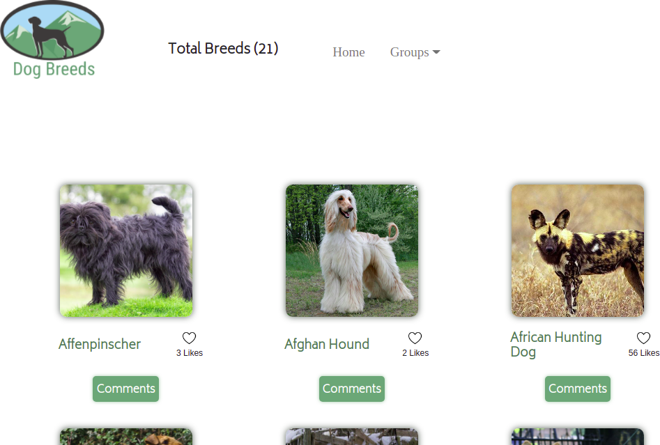

# Dog Breeds API

> App to discover all interesting dog breeds with facts.

## Built With

- HTML-CSS-JavaScript-Webpack-Jest

## Live Demo

[Visit Live Demo Link](https://notlfish.github.io/Dog-breeds/)

## Getting Started

You can visit the Live Demo or clone the repository and open the dist/html.index file with your browser to see the project.

To get a local copy of this repo follow these simple example steps:
- `git clone https://github.com/notlfish/Dog-breeds` to copy the repo.
- Follow the [Set-up and Install](#set-up--install) instructions.

### Prerequisites

- Before we begin, make sure you have a fresh version of Node.js installed

### Set-up & Install

- [First clone the repo](https://github.com/notlfish/Dog-breeds) and checkout the latest branch.

To install the latest release or a specific version, run one of the following commands:

- `npm install && npm install --dev` to install the project's dependencies.
- `npm start` to start the web server.
- Visit `http://localhost:8080/` to see the project.

To run the tests of the project (on the project's root directory):
- `npm run test` to run the test suite.
- `npx eslint . && npx stylelint "**/*.{css,scss}"` to run the linters.

## 👤 **Authors**

**Juan Felipe Gomez Tobon**

- GitHub: [@githubhandle](https://github.com/Felipeg005/)
- Twitter: [@twitterhandle](https://twitter.com/JuanFGT05)
- LinkedIn: [LinkedIn](https://www.linkedin.com/in/juan-felipe-gomez-tobon/)

👤 **Lucas Ferrari Soto**

- GitHub: [@notlfish](https://github.com/notlfish)
- Twitter: [@LucasFerrariSo1](https://twitter.com/LucasFerrariSo1)
- LinkedIn: [LinkedIn](https://www.linkedin.com/in/lucas-mauricio-ferrari-soto-472a3515a/)

## Show your support

Give a ⭐️ if you like this project!

## Acknowledgments

- Thanks to Microverse for making it possible!

## 📝 License

This project is [MIT](./MIT.md) licensed.
